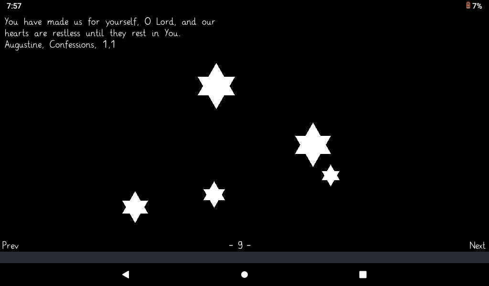

I couldn’t make any judgment on the Summa, except to say this: I read it every night before I go to
bed. If my mother were to come in during the process and say, “Turn off that light. It’s late,” I with
lifted finger and broad bland beatific expression, would reply, “On the contrary, I answer that the
light, being eternal and limitless, cannot be turned off. Shut your eyes,” or some such thing. In any
case I feel I can personally guarantee that St. Thomas loved God because for the life of me I cannot
help loving St. Thomas.

*—Flannery O’Connor, The Habit of Being*

# release dir

The release directory contains a .love file that shows
a dozen pages of citations when one clicks a star. The
code for the app is the content of this repository.

Here is a screenshot.

 

There is more info on the wiki section.

